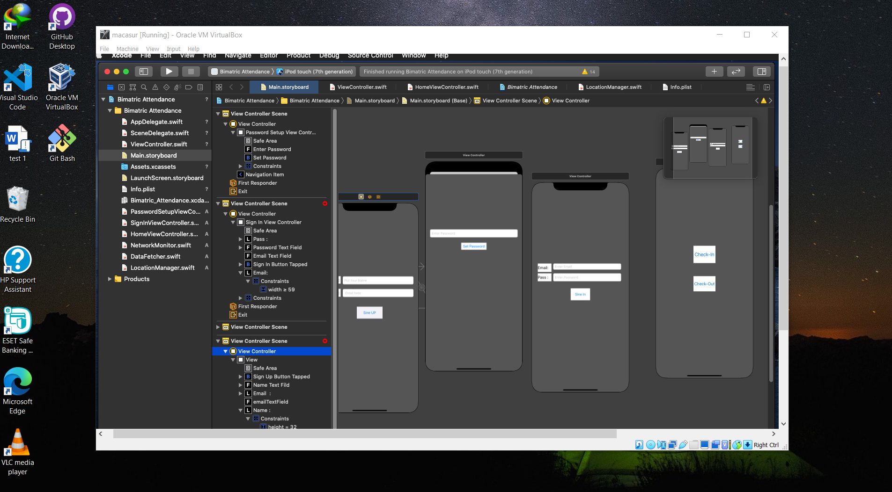
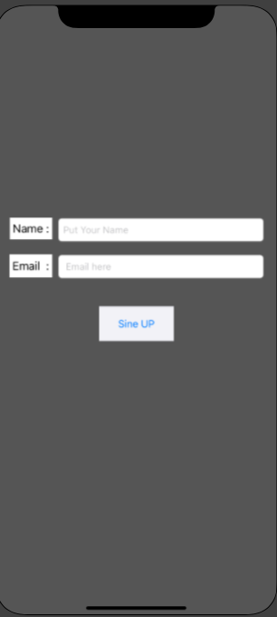
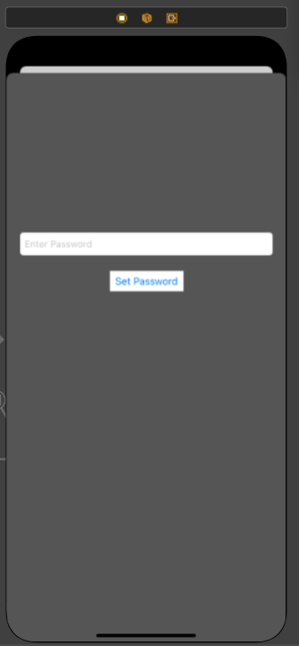
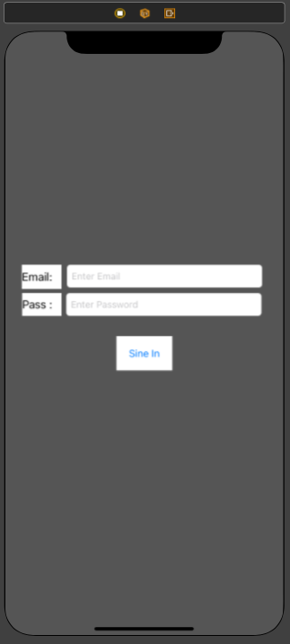
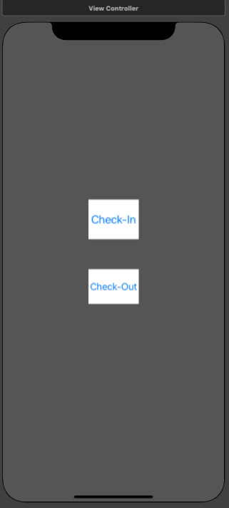

# Biometric Attendance Application

This project is a Biometric Attendance Application developed in Swift for iOS. It allows users to sign up, log in, and mark their attendance using biometric authentication and location validation.
I have done this project in CS 4405, Learning Journal Unit 7 at UoPeople.

<p align="center">

</p>

## Table of Contents
- [Introduction](#introduction)
- [Features](#features)
- [Prerequisites](#prerequisites)
- [Installation](#installation)
- [Usage](#usage)
- [Project Structure](#project-structure)
- [Contributing](#contributing)
- [License](#license)
- [Contact](#contact)

## Introduction

This application is created as a project for the CS 4405 course by Nippon Chowdhury, a B.Sc. student in Computer Science at the University of the People. The app demonstrates the use of biometric authentication and GPS location services in an iOS application.

## Features

- User Signup with email validation
- Password setup and storage
- User login with email and password validation
- Biometric authentication for checking in and out
- GPS location validation to ensure the user is at the office

## Prerequisites

- macOS with Xcode installed (latest version recommended)
- An iOS device or simulator running iOS 13.0 or later

## Installation

1. **Clone the Repository**:
   ```bash
   git clone https://github.com/iamnippon/iOS-Biometric-attendance-App.git
   cd biometric-attendance
   ```

2. **Open the Project in Xcode**:
   - Open Xcode.
   - Go to `File` > `Open` and navigate to the cloned repository.
   - Select the `BiometricAttendance.xcodeproj` file.

3. **Run the Project**:
   - Select a target device (an iOS simulator or a connected device).
   - Click the `Run` button or press `Cmd + R` to build and run the project.
  
## Screenshots
<p align="center">





</p>

## Usage

1. **Signup**:
   - Enter your name and a valid email address.
   - Tap the "Sign Up" button.

2. **Password Setup**:
   - After successful signup, set up your password.
   - Tap the "Set Password" button.

3. **Login**:
   - Enter your email and password to log in.
   - Tap the "Login" button.

4. **Home Screen**:
   - You will see two buttons: "Check-in" and "Check-out".
   - Tap either button to perform biometric authentication and validate your location.

## Project Structure

- **ViewController.swift**: Contains the signup and login logic.
- **PasswordSetupViewController.swift**: Manages the password setup screen.
- **HomeViewController.swift**: Handles the home screen, biometric authentication, and location validation.
- **LocationManager.swift**: Manages location services and updates.

## Contributing

Contributions are welcome! Please fork the repository and create a pull request with your changes.

1. Fork the Project
2. Create your Feature Branch (`git checkout -b feature/AmazingFeature`)
3. Commit your Changes (`git commit -m 'Add some AmazingFeature'`)
4. Push to the Branch (`git push origin feature/AmazingFeature`)
5. Open a Pull Request

## License

Distributed under the MIT License. See `LICENSE` for more information.

## Contact

Nippon Chowdhury  
Email: [mindbend91@gmail.com](mailto:mindbend91@gmail.com)  
B.Sc. in Computer Science, University of the People
```

### Explanation

1. **Introduction**: Provides a brief overview of the project, including your name and affiliation.
2. **Features**: Lists the key features of the application.
3. **Prerequisites**: Mentions the necessary software and hardware requirements.
4. **Installation**: Provides step-by-step instructions to clone, open, and run the project in Xcode.
5. **Usage**: Explains how to use the application, from signup to marking attendance.
6. **Project Structure**: Describes the main components of the project and their purposes.
7. **Contributing**: Encourages others to contribute and provides guidelines on how to do so.
8. **License**: Specifies the licensing information.
9. **Contact**: Provides your contact information for further inquiries.

This `README.md` file should make it easy for anyone to understand and use your project, even if they are beginners.
